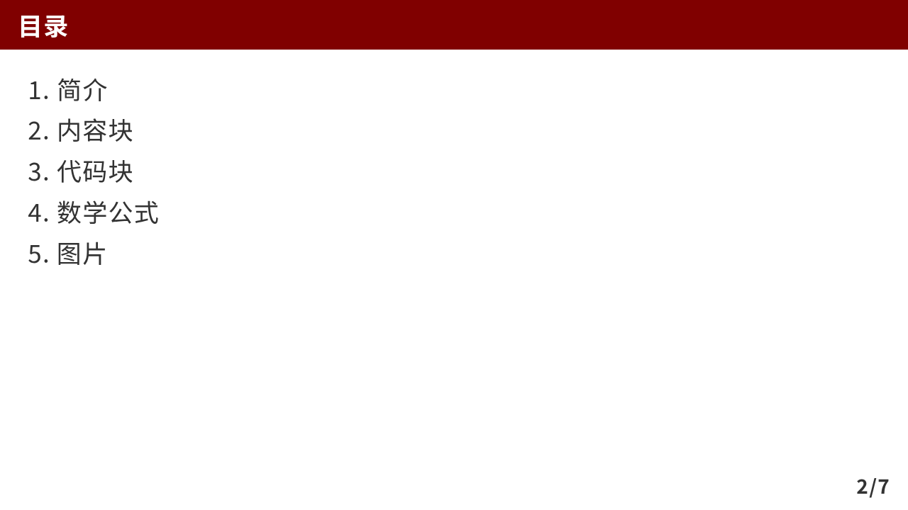
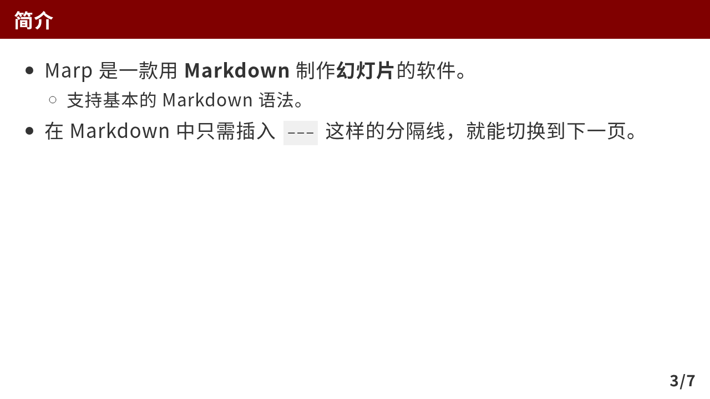
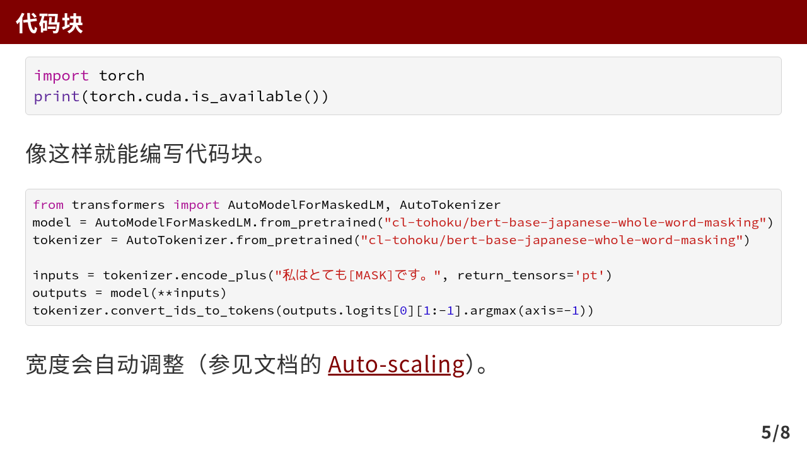
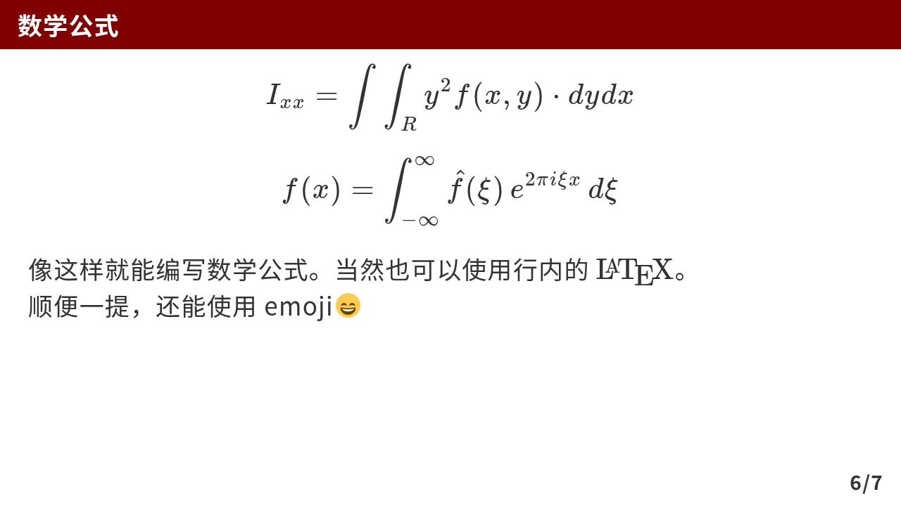
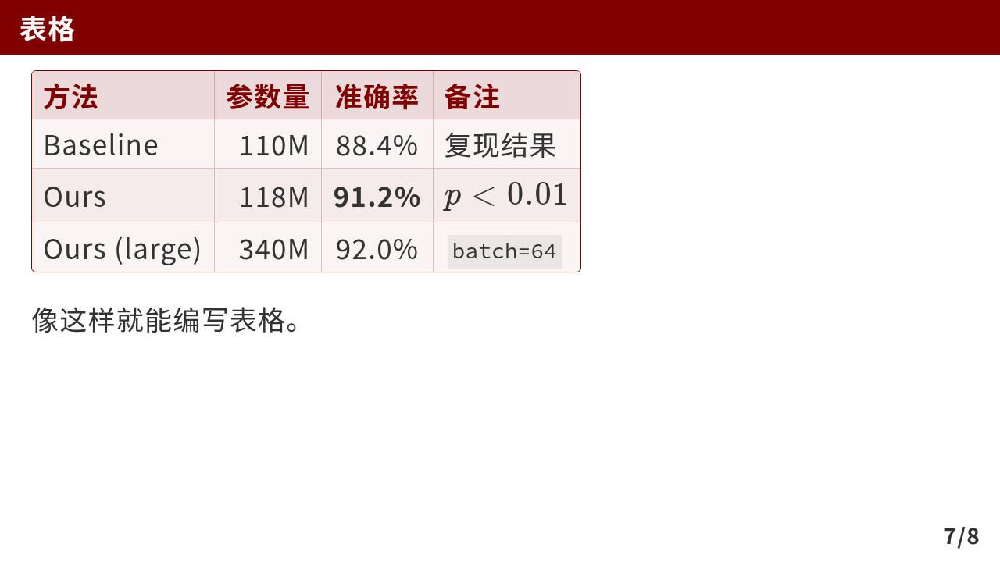

# marp-theme-academic

一个偏学术风格的 [Marp](https://marp.app/) 主题：用 Markdown 写幻灯片，比 Beamer 轻，比 PowerPoint 快。

Fork 自 [kaisugi/marp-theme-academic](https://github.com/kaisugi/marp-theme-academic)（MIT License，© 2022 Kaito Sugimoto），在原作者的基础上做了一些本地化与功能改动。


## 相比原仓库的修改

| 改动 | 内容 |
| --- | --- |
| **demo 中文化** | `demo.md` 由日文改写为简体中文；正文字体从 `Noto Sans JP` 换成 `Noto Sans SC` |
| **删除伪脚注** | 原仓库用 `$^1$` 配合一个底部绝对定位的引用块来模拟脚注，现已整段移除 |
| **引用块 → Beamer 式内容块** | 引用块（`>`）现在渲染成带边框和底色的内容块。**首行写成六级标题 `######` 时自动生成标题栏**，否则只有内容区；配色由主题色 `#800000` 派生（边框、标题栏、内容区三种深浅） |
| **代码配色换成 Xcode** | 原仓库沿用 Gaia 内置的 Sunburst（纯黑底），现改为 highlight.js 官方 Xcode 色板：浅灰底 + 1px 描边，注释绿、关键字紫、字符串暗红、数字蓝；行内代码改为中性浅灰 chip |
| **表格配色对齐内容框** | 表格与内容框**共用同一套变量**（`:root` 里的 `--box-*`），两者不会再各改各的：表头 = 标题栏（浅红底 + 深红粗体）、单元格 = 内容区、外框 = 1px 深红 + 6px 圆角；内部格线改浅红，斑马纹从第二行开始。原仓库是 Gaia 默认的深灰 `#333` 表头、每格深灰格线、蓝灰斑马纹 |

## 安装

假设你已经装好 [Marp for VS Code](https://marketplace.visualstudio.com/items?itemName=marp-team.marp-vscode)。

在项目里放一个 `.vscode/settings.json` 指定主题文件：

```json
{
    "markdown.marp.themes": [
        "https://raw.githubusercontent.com/xizai-cmd/marp-theme-academic/main/themes/academic.css"
    ]
}
```

之后在 Markdown 开头加上 front matter，就可以用了：

```
---
marp: true
theme: academic
paginate: true
math: katex
---
```

最小示例（封面页）：

```markdown
<!-- _class: lead -->

# 用 Marp 制作研究室汇报幻灯片

#### ～告别 Beamer～

<br>

**作者 太郎**
某某研究室 M2
YYYY/MM/DD
```

## 演示

### 目录

```markdown
<!-- _header: 目录 -->

1. 简介
1. 内容块
1. 代码块
1. 数学公式
1. 表格
1. 图片
```



### 简介

```markdown
<!-- _header: 简介 -->

- Marp 是一款用 **Markdown** 制作**幻灯片**的软件。
  - 支持基本的 Markdown 语法。
- 在 Markdown 中只需插入 `---` 这样的分隔线，就能切换到下一页。
```



### 内容块

引用块即内容块。首行是六级标题 `######` 时生成标题栏，否则没有标题栏：

```markdown
<!-- _header: 内容块 -->

> ###### 定义
>
> 把引用块的第一行写成六级标题 `######`，就会生成像这样的标题栏。

> 第一行不是六级标题时，就是一个没有标题栏的内容块。
```


### 代码块

````markdown
<!-- _header: 代码块 -->

```python
import torch
print(torch.cuda.is_available())
```

像这样就能编写代码块。

```python
from transformers import AutoModelForMaskedLM, AutoTokenizer
model = AutoModelForMaskedLM.from_pretrained("cl-tohoku/bert-base-japanese-whole-word-masking")
tokenizer = AutoTokenizer.from_pretrained("cl-tohoku/bert-base-japanese-whole-word-masking")

inputs = tokenizer.encode_plus("私はとても[MASK]です。", return_tensors='pt')
outputs = model(**inputs)
tokenizer.convert_ids_to_tokens(outputs.logits[0][1:-1].argmax(axis=-1))
```

宽度会自动调整（参见文档的 [Auto-scaling](https://github.com/marp-team/marp-core#auto-scaling-features)）。
````



### 数学公式

```markdown
<!-- _header: 数学公式 -->

$$ I_{xx}=\int\int_Ry^2f(x,y)\cdot{}dydx $$

$$
f(x) = \int_{-\infty}^\infty
    \hat f(\xi)\,e^{2 \pi i \xi x}
    \,d\xi
$$

像这样就能编写数学公式。当然也可以使用行内的 $\LaTeX$。  
顺便一提，还能使用 emoji:smile:
```



### 表格

支持 Markdown 表格语法；表头、单元格边框与斑马纹由主题提供，列对齐用 `:---` / `---:` / `:---:` 控制：

```markdown
<!-- _header: 表格 -->

| 方法 | 参数量 | 准确率 | 备注 |
| :--- | ---: | :---: | :--- |
| Baseline | 110M | 88.4% | 复现结果 |
| Ours | 118M | **91.2%** | $p < 0.01$ |
| Ours (large) | 340M | 92.0% | `batch=64` |

像这样就能编写表格。
```



### 图片

```markdown
<!-- _header: 图片 -->

1. 首先从[这个 Irasutoya 链接](https://www.irasutoya.com/2018/10/blog-post_723.html)右键下载图片（`kenkyu_woman_seikou.png`）。
2. 在此 Markdown 文件所在的目录中新建一个名为 `images` 的目录，并把刚才下载的图片放进去。这样准备工作就完成了。


```


## 反馈

主题有问题或想加功能，欢迎开 Issue / PR。

如果这个主题帮到了你，也请给原仓库 [kaisugi/marp-theme-academic](https://github.com/kaisugi/marp-theme-academic) 点个 star 🌟

## 许可

[MIT License](./LICENSE)。版权归原作者 Kaito Sugimoto 所有，本仓库仅在其基础上修改。
